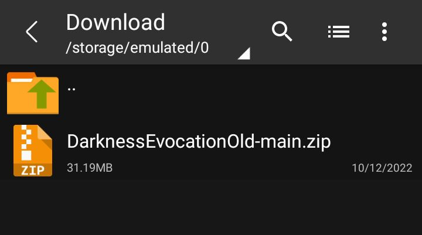
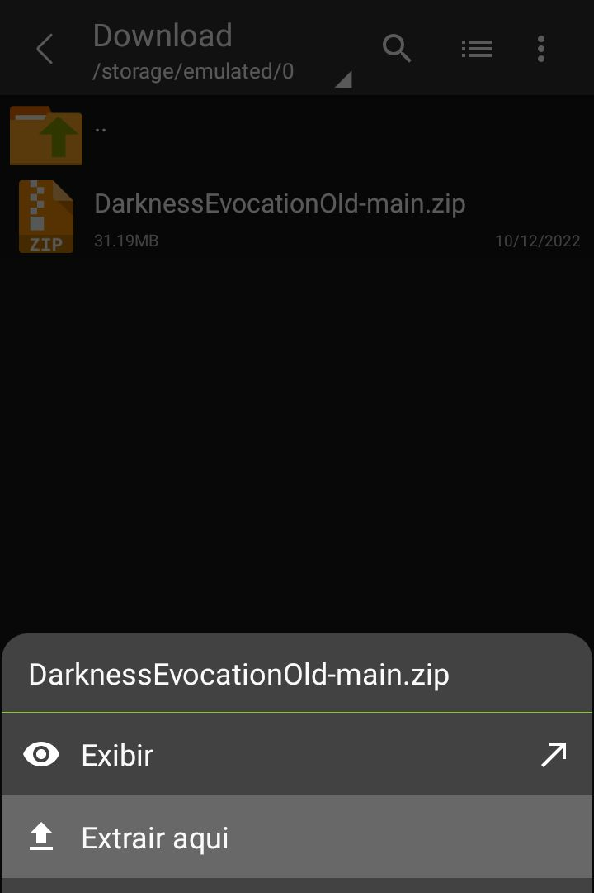
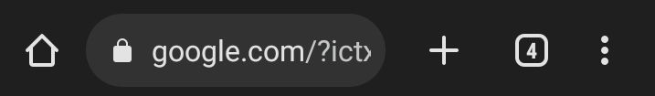

Olá🤘 Beta v0.0.0.2

<h2>-> o que temos até agora:</h2>
    
|   -> inicio ícone Darkness Studio.

    
|   -> tela menu principal

    
|   -> modo tela cheia

    
|   -> menu opções +/-

<h2>Como instalar?</h2>
 
| Android: 

 
| Windows: 

 
| Ou se preferir vc pode rodar a versão online (apartir do navegador) aqui:
    
https://darknessstudio34.github.io/DarknessEvocation/

 

 /*
|   -> atualmente não tenho um como compilar os arquivos em um executável ou arquivo de instalação 😕, entretanto você pode baixar o arquivo (zip) do projeto aqui:
 
 
https://drive.google.com/drive/folders/1VkpfWDuwM-S8v5GrPx7gCQcuC27xhXOd

 <h2>Instruções de como rodar o projeto offline:</h2>

Baixe o arquivo clicando no link acima e selecionando a versão na qual deseja executar. 
Ou se prefirir, aqui a ultima versão lançada: (pode ser que esteja desatualizado...)

<h3>Android</h3> extraia o arquivo do projeto (se você não possui um gerenciador de arquivos, recomendo Zarchiver  https://play.google.com/store/apps/details?id=ru.zdevs.zarchiver)

-> com o Zarchiver: vá até o diretorio onde encontra-se o arquivo que foi baixado (geralmente na pasta download (/storage/emulated/0/download) de um clique sobre o nome do arquivo, em seguida clique em 'extrair aqui'

Agora copie o seguinte enderço e cole na barra de endereço de seu navegador  file:///storage/emulated/0/Download/DarknessEvocation/index.html

Caso dê algum erro, verifique se o arquivo encontra-se no diretorio acima.*/
Caso mesmo assim você tenha alguma dúvida ou não tenha funcionado, entre em contato em DarknessStudio34@gmail.com

#es-us
Beta 0.0.0.1
-> files contents:
    -> start icon Darkness Studio
    -> main menu scene
    -> fullscreen mode

°
How to install? 
-> you can run the online version (from the browser) here: https://fabriciofkt157.github.io/DarknessEvocation/ 
-> I currently don't have a way to compile the files into an executable or installation file, however you can download the (zip) file of the project here: https://drive.google.com/drive/folders/1VkpfWDuwM-S8v5GrPx7gCQcuC27xhXOd Being able to run the project offline (without internet connection). 
Instructions on how to run the project offline: 
Download the file by clicking the link above and selecting the version you want to run on. Or if you prefer, here is the latest version released: 
Optimized for mobile devices: 
Optimized for PC (or other devices with the highest aspect ratio): 

Android: extract the project file (if you don't have a file manager, I recommend Zarchiver https://play.google.com/store/apps/details?id=ru.zdevs.zarchiver) 
-> with Zarchiver: go to the directory where the downloaded file is located (usually in the download folder (/storage/emulated/0/download), click on the file name, then click on 'extract to /filename/' Now copy the following address and paste it into your browser's address bar (note that it should be the address bar (usually at the top of the screen) and not the google search bar): file:///storage/emulated/ 0/download/DarknessEvocation/index.html If there is an error, check if the file is in the downloads folder. Or try replacing the directory above with file:///storage/emulated/0/downloads/DarknessEvocation/index.html or also: file://storage/emulated/0/download/DarknessEvocation/index.html If you still have any questions or it didn't work, please contact DarknessStudio34@gmail.com

